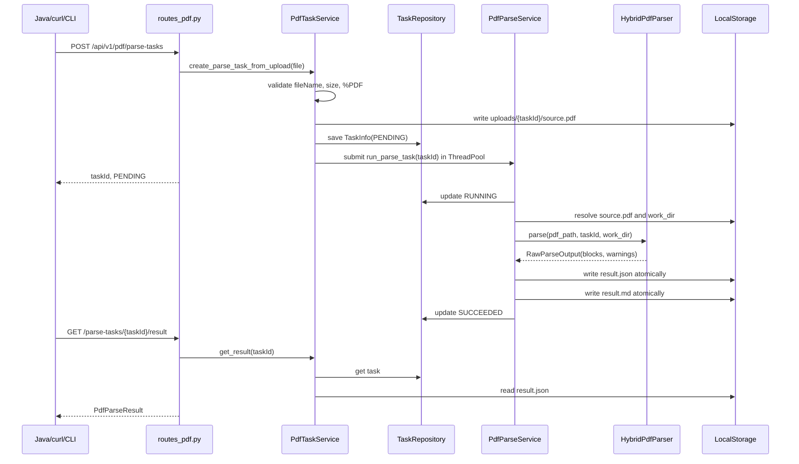

# 02. 服务层与任务流说明书

本篇解释这些文件：

```text
ai_translation_py/services/pdf_task_service.py
ai_translation_py/services/pdf_parse_service.py
ai_translation_py/services/result_service.py
```

服务层是这个 Python 项目的主干，读懂它基本就读懂了任务生命周期。

## 1. 服务层整体分工

```text
PdfTaskService
  门面服务。接 API/CLI 请求，校验 PDF，创建任务，保存源文件，提交后台线程，查询任务和结果。

PdfParseService
  执行服务。拿 taskId 找 source.pdf，调用 HybridPdfParser，生成 PdfParseResult，写 result.json/result.md，更新任务状态。

ResultService
  结果查询服务。校验任务是否成功，读取 result.json 或 result.md。
```

Java 类比：

```text
PdfTaskService       类似 Facade/Application Service
PdfParseService      类似 Domain Service 或 Worker Service
ResultService        类似 Query Service
TaskRepository       类似 Repository
LocalStorage         类似 Storage Gateway
```

## 2. `PdfTaskService`

### 2.1 职责

文件：

```text
ai_translation_py/services/pdf_task_service.py
```

它负责：

- 接收上传文件或本地文件路径。
- 校验 PDF 文件名、大小、文件头。
- 创建 `TaskInfo`。
- 把源 PDF 保存到 `data/uploads/{taskId}/source.pdf`。
- 把任务状态保存到 `data/tasks/{taskId}.json`。
- 提交后台解析线程。
- 给 API 层提供 `get_task/get_result/get_markdown` 门面方法。

### 2.2 构造函数

```python
def __init__(
    self,
    settings: Settings,
    storage: LocalStorage,
    repository: TaskRepository,
    parse_service: PdfParseService,
    result_service: ResultService,
    executor: ThreadPoolExecutor,
) -> None:
    self.settings = settings
    self.storage = storage
    self.repository = repository
    self.parse_service = parse_service
    self.result_service = result_service
    self.executor = executor
```

这就是手动依赖注入。

Java Spring 中你可能会写：

```java
@Service
@RequiredArgsConstructor
public class PdfTaskService {
    private final Settings settings;
    private final LocalStorage storage;
    private final TaskRepository repository;
    private final PdfParseService parseService;
    private final ResultService resultService;
    private final ExecutorService executor;
}
```

Python 没有 Spring 容器，这里用 `build_pdf_task_service()` 手动组装依赖。

### 2.3 API 上传入口：`create_parse_task_from_upload`

方法签名：

```python
async def create_parse_task_from_upload(
    self,
    upload_file: UploadFile,
    *,
    options: dict[str, Any] | None = None,
    submit: bool = True,
) -> TaskInfo:
```

参数说明：

- `upload_file`：FastAPI 的上传文件对象。
- `options`：预留解析参数，现在主流程没有使用。
- `submit`：是否创建任务后立刻提交后台解析。API 走默认 `True`。

注意这里的 `*`：

```python
upload_file: UploadFile,
*,
options: ...
submit: ...
```

`*` 后面的参数只能用关键字传参，不能按位置传参。这样可以避免误传。

正确：

```python
service.create_parse_task_from_upload(file, options={}, submit=True)
```

错误：

```python
service.create_parse_task_from_upload(file, {}, True)
```

### 2.4 上传文件保存逻辑

核心代码：

```python
target = self.storage.upload_pdf_path(task.task_id)
target.parent.mkdir(parents=True, exist_ok=True)
tmp = target.with_suffix(".pdf.tmp")
size = 0
first_chunk = b""
try:
    with tmp.open("wb") as handle:
        while True:
            chunk = await upload_file.read(1024 * 1024)
            if not chunk:
                break
            if not first_chunk:
                first_chunk = chunk
            size += len(chunk)
            if size > self.settings.max_file_bytes:
                raise AiTranslationPyError(...)
            handle.write(chunk)
    self._validate_pdf_magic(first_chunk)
except Exception:
    if tmp.exists():
        tmp.unlink()
    raise
```

逐行解释：

- `target` 是最终路径：`data/uploads/{taskId}/source.pdf`。
- `tmp` 是临时路径：`source.pdf.tmp`。
- `while True` 循环每次读取 1MB。
- `first_chunk` 保存第一块数据，用来校验文件头。
- 如果超过大小限制，抛业务异常。
- 如果中途出错，删除临时文件。
- 校验通过后再把临时文件替换成正式文件。

为什么先写 `.tmp`：

- 避免解析线程或其他进程读到半个 PDF。
- 只有完整写入成功才替换成正式文件。

最终替换：

```python
target.unlink(missing_ok=True)
tmp.replace(target)
```

### 2.5 本地路径入口：`create_parse_task_from_path`

这个方法给 CLI 使用：

```python
def create_parse_task_from_path(
    self,
    source_path: Path,
    *,
    options: dict[str, Any] | None = None,
    submit: bool = True,
) -> TaskInfo:
```

它和上传入口做同一套事情：

- 校验文件存在。
- 校验 `.pdf` 后缀。
- 校验文件大小。
- 校验 `%PDF` 文件头。
- 创建任务。
- 复制源 PDF 到任务上传目录。
- 保存任务。
- 根据 `submit` 决定是否后台执行。

为什么 CLI 不直接调用 parser：

- 复用完整任务流程。
- CLI 和 API 行为保持一致。
- 解析结果仍然落在标准 `data/results/{taskId}` 目录。

### 2.6 提交后台任务：`submit_parse_task`

```python
def submit_parse_task(self, task_id: str) -> None:
    self.executor.submit(self.parse_service.run_parse_task, task_id)
```

这行代码非常关键。它把耗时解析交给线程池，不阻塞 HTTP 请求。

Java 类比：

```java
executor.submit(() -> parseService.runParseTask(taskId));
```

线程池在哪里创建：

```python
executor = ThreadPoolExecutor(max_workers=settings.workers, thread_name_prefix="pdf-parser")
```

`settings.workers` 默认是 2，对应环境变量：

```text
AI_TRANSLATION_PY_WORKERS
```

### 2.7 查询门面方法

```python
def get_task(self, task_id: str) -> TaskInfo:
    return self.repository.get(task_id)

def get_result(self, task_id: str) -> PdfParseResult:
    return self.result_service.get_result(task_id)

def get_markdown(self, task_id: str) -> str:
    return self.result_service.get_markdown(task_id)
```

这些方法没有复杂逻辑，只是让 API 层不用直接感知 repository/result_service。

### 2.8 创建任务对象：`_create_task_record`

```python
def _create_task_record(self, file_name: str) -> TaskInfo:
    now = datetime.now(UTC)
    task_id = f"pdf_{now:%Y%m%d_%H%M%S}_{uuid.uuid4().hex[:8]}"
    return TaskInfo(
        taskId=task_id,
        fileName=file_name,
        status=TaskStatus.PENDING,
        progress=0,
        currentStep="pending",
        warnings=[],
        createdAt=now,
        updatedAt=now,
    )
```

任务 ID 示例：

```text
pdf_20260621_153000_ab12cd34
```

注意字段传参使用 camelCase：

```python
taskId=task_id
fileName=file_name
currentStep="pending"
```

这是因为 `TaskInfo` 使用了 Pydantic alias。内部字段是 `task_id`，但构造时允许用别名 `taskId`。

### 2.9 PDF 校验

```python
@staticmethod
def _validate_pdf_file_name(file_name: str) -> None:
    if not file_name.lower().endswith(".pdf"):
        raise AiTranslationPyError(...)
```

文件名必须 `.pdf`。

```python
@staticmethod
def _validate_pdf_magic(first_bytes: bytes) -> None:
    if not first_bytes.startswith(b"%PDF"):
        raise AiTranslationPyError(...)
```

文件内容必须以 `%PDF` 开头。

这比只看后缀更可靠。

### 2.10 `parse_options`

```python
def parse_options(options: str | None) -> dict[str, Any]:
    if not options:
        return {}
    try:
        data = json.loads(options)
    except json.JSONDecodeError as exc:
        raise AiTranslationPyError("INVALID_OPTIONS", "Options must be valid JSON", status_code=400) from exc
    if not isinstance(data, dict):
        raise AiTranslationPyError("INVALID_OPTIONS", "Options must be a JSON object", status_code=400)
    return data
```

用于解析 multipart 表单里的 `options` 字符串。

要求：

- 必须是合法 JSON。
- 顶层必须是 object，也就是 Python 的 `dict`。

### 2.11 `build_pdf_task_service`

```python
@lru_cache(maxsize=1)
def build_pdf_task_service() -> PdfTaskService:
    settings = get_settings()
    storage = LocalStorage(settings)
    repository = TaskRepository(storage)
    parse_service = PdfParseService(settings, storage, repository)
    result_service = ResultService(storage, repository)
    executor = ThreadPoolExecutor(max_workers=settings.workers, thread_name_prefix="pdf-parser")
    return PdfTaskService(settings, storage, repository, parse_service, result_service, executor)
```

这是整个服务的“手动 Bean 工厂”。

Java Spring 类比：

```java
@Configuration
public class PdfServiceConfig {
    @Bean
    public PdfTaskService pdfTaskService(...) { ... }
}
```

`@lru_cache(maxsize=1)` 让它变成单例。

## 3. `PdfParseService`

### 3.1 职责

文件：

```text
ai_translation_py/services/pdf_parse_service.py
```

它负责：

- 把任务状态从 `PENDING` 改成 `RUNNING`。
- 找到 `source.pdf`。
- 创建 `work_dir`。
- 调用 `HybridPdfParser`。
- 组装 `PdfParseResult`。
- 生成 `plainText` 和 `markdown`。
- 写 `result.json/result.md`。
- 把任务状态改成 `SUCCEEDED`。
- 捕获异常，把任务状态改成 `FAILED`。

### 3.2 构造函数

```python
def __init__(
    self,
    settings: Settings,
    storage: LocalStorage,
    repository: TaskRepository,
    parser: HybridPdfParser | None = None,
    renderer: MarkdownRenderer | None = None,
) -> None:
    self.settings = settings
    self.storage = storage
    self.repository = repository
    self.parser = parser or HybridPdfParser(settings)
    self.renderer = renderer or MarkdownRenderer()
```

这里允许传入自定义 parser/renderer，方便测试或替换实现。

Java 类比：

```java
this.parser = parser != null ? parser : new HybridPdfParser(settings);
```

### 3.3 开始解析时更新任务状态

```python
self.repository.update(
    task_id,
    lambda task: task.model_copy(
        update={
            "status": TaskStatus.RUNNING,
            "progress": 5,
            "current_step": "hybrid_parse",
            "error_code": None,
            "error_message": None,
        }
    ),
)
```

这里有两个 Python 写法需要理解：

1. `lambda task: ...`

   匿名函数，类似 Java lambda：

   ```java
   task -> task.copy(...)
   ```

2. `model_copy(update={...})`

   Pydantic 模型通常按不可变数据思路处理。这里复制一个新对象，并更新指定字段。

### 3.4 调用解析器

```python
pdf_path = self.storage.upload_pdf_path(task_id)
work_dir = self.storage.work_dir(task_id)
work_dir.mkdir(parents=True, exist_ok=True)
raw_output = self.parser.parse(pdf_path, task_id=task_id, work_dir=work_dir)
```

解释：

- `pdf_path` 指向上传的 `source.pdf`。
- `work_dir` 给 MinerU 等解析器放中间文件。
- `self.parser` 默认是 `HybridPdfParser`。

调用链继续进入：

```text
HybridPdfParser.parse
  -> MineruParser.parse
  -> UnstructuredParser.parse
  -> PypdfTextParser.parse
  -> PdfImageAssetParser.parse
  -> BlockNormalizer.normalize
```

### 3.5 组装 `PdfParseResult`

```python
result = PdfParseResult(
    taskId=task_id,
    fileName=task.file_name,
    pageCount=raw_output.page_count,
    parserStrategy=HybridPdfParser.strategy_name,
    status=TaskStatus.SUCCEEDED,
    warnings=[*task.warnings, *raw_output.warnings],
    blocks=raw_output.blocks,
    markdown=None,
    plainText=_render_plain_text(raw_output.blocks),
    createdAt=task.created_at,
    completedAt=completed_at,
)
```

重要字段：

- `blocks`：结构化结果，给系统消费。
- `plainText`：转成纯文本/Markdown 风格文本，给 Java `ChunkEngine` 继续分块。
- `markdown`：人类查看用的 Markdown，稍后由 `MarkdownRenderer` 生成。

`[*task.warnings, *raw_output.warnings]` 是列表展开，相当于 Java：

```java
List<String> warnings = new ArrayList<>();
warnings.addAll(task.getWarnings());
warnings.addAll(rawOutput.getWarnings());
```

### 3.6 生成 Markdown

```python
markdown = self.renderer.render(result)
result = result.model_copy(update={"markdown": markdown})
```

为什么先创建 `markdown=None`，再 copy 一次：

- `MarkdownRenderer.render(result)` 需要拿到完整 result 元信息和 blocks。
- 渲染完成后再把 markdown 填回 result。

### 3.7 原子写结果

```python
self.storage.write_json_atomic(
    self.storage.result_json_path(task_id),
    result.model_dump(mode="json", by_alias=True),
)
self.storage.write_text_atomic(self.storage.result_markdown_path(task_id), markdown)
```

`model_dump(mode="json", by_alias=True)` 很重要：

- `mode="json"`：把 datetime 等对象转成 JSON 可序列化格式。
- `by_alias=True`：输出 camelCase 字段，比如 `taskId`、`fileName`、`pageCount`。

Java 后端 DTO 使用 camelCase，所以这里要保持一致。

### 3.8 成功状态更新

```python
self.repository.update(
    task_id,
    lambda existing: existing.model_copy(
        update={
            "status": TaskStatus.SUCCEEDED,
            "progress": 100,
            "current_step": "completed",
            "warnings": result.warnings,
        }
    ),
)
```

写完 `result.json/result.md` 后，才把任务标记成 `SUCCEEDED`。

这样调用方轮询到 `SUCCEEDED` 时，结果文件理论上已经存在。

### 3.9 失败处理

```python
except AiTranslationPyError as exc:
    self._mark_failed(task_id, exc.error_code, exc.message)
    logger.exception(...)
except Exception as exc:
    self._mark_failed(task_id, ErrorCode.PDF_PARSE_FAILED, str(exc))
    logger.exception(...)
```

两类异常：

- `AiTranslationPyError`：业务异常，保留明确错误码。
- 普通 `Exception`：未知异常，统一转成 `PDF_PARSE_FAILED`。

`logger.exception(...)` 会自动打印堆栈。

### 3.10 `_render_plain_text`

```python
def _render_plain_text(blocks) -> str:
    translatable_types = {
        "title",
        "heading",
        "paragraph",
        "list_item",
        "table",
        "figure",
        "header",
        "footer",
        "unknown",
    }
    parts: list[str] = []
    for block in blocks:
        if block.type not in translatable_types:
            continue
        text = block.text or block.markdown
        ...
        if block.type == "title":
            parts.append(f"# {text}")
        elif block.type == "heading":
            parts.append(f"## {text}")
        elif block.type == "list_item":
            parts.append(text if text.startswith(("-", "*")) else f"- {text}")
        elif block.type == "figure":
            asset_id = block.metadata.get("assetId") if block.metadata else None
            parts.append(f"[PDF image: {asset_id or block.block_id}]")
        else:
            parts.append(text)
    return "\n\n".join(parts)
```

这个函数给 Java 后端用。Java 后端当前主要消费纯文本，再用自己的 `ChunkEngine` 分块落库。

为什么 `figure` 也进入 `plainText`：

- 不是为了翻译图片本身。
- 是为了在文本中保留图片占位。
- Java 可以通过 block metadata 再处理真实图片资产。

## 4. `ResultService`

### 4.1 职责

文件：

```text
ai_translation_py/services/result_service.py
```

它只负责查询结果。

### 4.2 查询 JSON 结果

```python
def get_result(self, task_id: str) -> PdfParseResult:
    task = self.repository.get(task_id)
    if task.status != TaskStatus.SUCCEEDED:
        raise AiTranslationPyError(
            ErrorCode.PDF_RESULT_NOT_READY,
            "PDF parse result is not ready",
            status_code=409,
        )
    path = self.storage.result_json_path(task_id)
    if not path.exists():
        raise AiTranslationPyError(...)
    return PdfParseResult.model_validate(json.loads(path.read_text(encoding="utf-8")))
```

流程：

1. 任务不存在，`repository.get` 抛 `PDF_TASK_NOT_FOUND`。
2. 任务不是 `SUCCEEDED`，抛 `PDF_RESULT_NOT_READY`。
3. 结果文件不存在，也抛 `PDF_RESULT_NOT_READY`。
4. 读取 JSON。
5. 用 Pydantic 校验并转成 `PdfParseResult`。

HTTP 层会把 `PDF_RESULT_NOT_READY` 转成 409。

### 4.3 查询 Markdown 结果

```python
def get_markdown(self, task_id: str) -> str:
    task = self.repository.get(task_id)
    if task.status != TaskStatus.SUCCEEDED:
        raise AiTranslationPyError(...)
    path = self.storage.result_markdown_path(task_id)
    if not path.exists():
        raise AiTranslationPyError(...)
    return path.read_text(encoding="utf-8")
```

逻辑和 JSON 结果一样，只是返回字符串。

## 5. 任务状态流转

当前状态枚举在 `core/task_status.py`：

```python
class TaskStatus(StrEnum):
    PENDING = "PENDING"
    RUNNING = "RUNNING"
    SUCCEEDED = "SUCCEEDED"
    FAILED = "FAILED"
    CANCELED = "CANCELED"
```

当前代码实际使用：

```text
PENDING
  创建任务后写入

RUNNING
  PdfParseService.run_parse_task 开始时写入

SUCCEEDED
  result.json 和 result.md 写完后写入

FAILED
  解析异常时写入
```

`CANCELED` 目前只是预留。

## 6. 服务层完整时序



## 7. 服务层排查点

### 创建任务失败

重点看：

```text
PdfTaskService._validate_pdf_file_name
PdfTaskService._validate_pdf_magic
settings.max_file_bytes
data/uploads/{taskId}/source.pdf.tmp
```

常见原因：

- 文件后缀不是 `.pdf`。
- 文件内容不是 PDF。
- 文件超过 `AI_TRANSLATION_PY_MAX_FILE_MB`。
- data 目录没有写权限。

### 任务一直 RUNNING

重点看：

```text
data/tasks/{taskId}.json
data/work/{taskId}
日志里的 pdf_parse_start / pdf_parse_failed / pdf_parse_succeeded
```

常见原因：

- MinerU 运行时间长。
- `mineru_timeout_seconds` 配置太大，等待时间长。
- 后台线程阻塞。

### result 接口返回 409

代表 `ResultService` 认为结果还不可用。

检查：

- task status 是否是 `SUCCEEDED`。
- `data/results/{taskId}/result.json` 是否存在。
- 任务是否失败但调用方仍在取 result。

