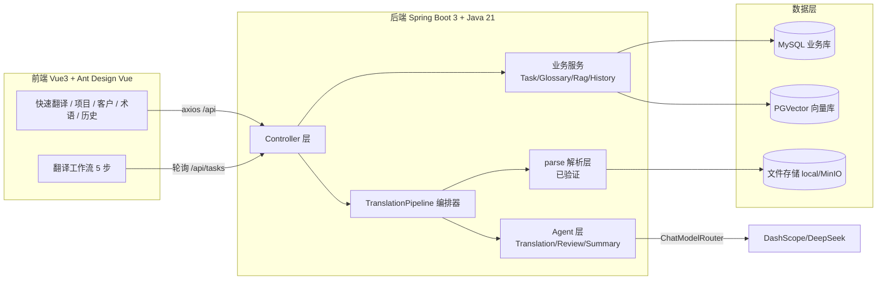
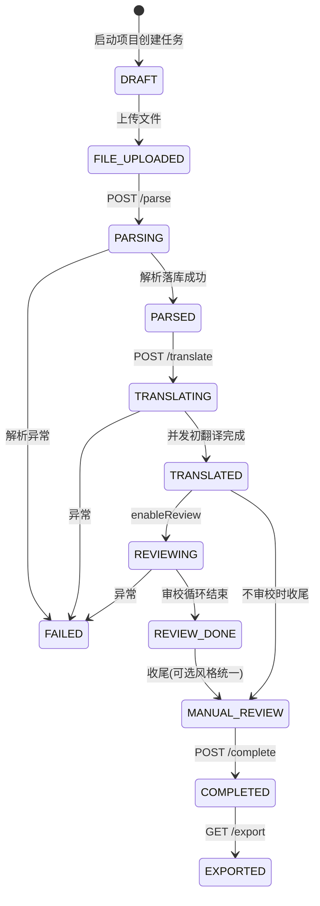
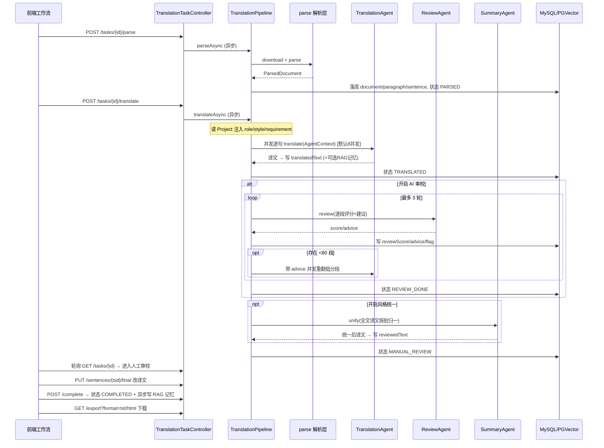
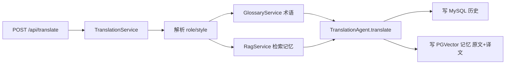

# AI 翻译助手 V1 — 代码结构与流程说明（Review 用）

> 本文档对应「Agent 重做 + 前端重设计」后的代码现状，供 Review。
> 约定：文档解析层 `service/parse/*` 为已验证逻辑（只改不重做）；其余 AI Agent 逻辑按 V1 重做。

---

## 一、总体架构



技术栈：

- 后端：Java 21 / Spring Boot 3.5 / Spring AI 1.1 / MyBatis-Plus / MySQL + PGVector / Apache POI + Okapi（解析）。
- 前端：Vue 3 + Vite + Ant Design Vue + Axios（无路由，侧边菜单切换；工作流由后端任务 status 驱动 + 2s 轮询）。
- 模型：DashScope（qwen-plus/max/turbo，OpenAI 兼容）、DeepSeek（deepseek-chat），运行时按任务配置切换。

---

## 二、后端代码结构（`com.xx.aitranslation`）

### 2.1 agent —— AI Agent 层（本次重做核心）

| 文件 | 职责 |
|------|------|
| `agent/AgentContext.java` | 翻译调用上下文（Builder）：`text / sourceLang / targetLang / role / style / glossaryRules / ragContext / reviewAdvice / modelCode`。单句翻译与文档流水线共用。 |
| `agent/TranslationAgent.java` | **翻译 Agent（V1 模块三/六）**。唯一入口 `translate(AgentContext)`：经 `ChatModelRouter` 选模型，渲染 `translation-prompt.st`。`reviewAdvice` 非空即「反馈优化重翻」模式；源/目标语种为空则让模型自动识别方向。 |
| `agent/ReviewAgent.java` | **AIPE 审校 Agent（V1 模块五）**。原文/译文成对送审，逐段输出 `score(0-100)+advice`；按 15 段分批，单批解析失败回退 80 分（防卡死）。结构化输出绑定 `ReviewResult`。 |
| `agent/SummaryAgent.java` | **汇总 Agent（V1 模块七，新增）**。全文风格统一（术语/语气/时态/人称/格式），按 15 段分批、以 `orderNo` 对齐；失败回退原译文。结构化输出绑定 `SummaryResult`。 |

> 已删除旧的 `service/ai/TranslationLlmService`、`service/ai/ReviewLlmService`、冗余 `config/SpringAIConfig`，逻辑全部并入 agent 包。

### 2.2 service/ai —— 模型路由

| 文件 | 职责 |
|------|------|
| `service/ai/ChatModelRouter.java` | 按模型 code 解析服务商并构建 `ChatClient`：DashScope 系走 `OpenAiChatModel`（temperature 0.3），DeepSeek 系走 `DeepSeekChatModel`（temperature 0.2）；未识别回退 `qwen-plus`。 |

### 2.3 service/pipeline —— 编排器（planner）

| 文件 | 职责 |
|------|------|
| `service/pipeline/TranslationPipeline.java` | 按状态机驱动全流程。`parseAsync` 解析；`translateAsync` 并发初翻译→（可选）审校循环→（可选）风格统一→人工审校。内含私有 `TranslationContext` 快照，避免并发中反复读配置。 |

关键常量/机制：

- 并发翻译：`translationExecutor` 线程池（`app.translation.concurrency`，默认 8），`CompletableFuture` 提交每句、`allOf().join()` 等待。
- 审校：`PASS_SCORE=80`、`MAX_ROUND=3`，低分段带 advice 并发重翻。
- role/style/requirement：从所属 `Project` 注入各 Agent（修复原先恒为 null）。

### 2.4 service/parse —— 文档解析层（已验证，未重做）

| 文件 | 职责 |
|------|------|
| `DocumentParser` / `DocumentParserFactory` | 解析接口与按 `FileType` 选实现的工厂。 |
| `DocxDocumentParser` | DOCX：POI 遍历段落 + SRX 分句。 |
| `OkapiDocumentParser`(抽象) / `OkapiHtmlDocumentParser` / `OkapiTxtDocumentParser` | HTML（Okapi Filter）/ TXT（按行）解析 + SRX 分句。 |
| `ParseSrxLoader` / `ParseTextUtils` / `ParseLocaleHelper` | SRX 分句、文本清洗与不可译过滤、语言→LocaleId 映射。 |
| `ParsedDocument` / `ParsedParagraph` / `ParsedSentence` | 解析输出的内存三层结构（段落顺序 `orderNo`、段内 `sentIndex`）。 |

> 编排器仅经工厂消费 `ParsedDocument`，翻译/审校单元始终是 `TranslationSentence`（全局 `orderNo` 为对齐键）。

### 2.5 service —— 业务服务

| 文件 | 职责 |
|------|------|
| `TranslationService.java` | 单句即时翻译编排：解析 role/style→术语→RAG→`TranslationAgent`→写 MySQL 历史 + PGVector 记忆。 |
| `TranslationTaskService.java` | 任务 CRUD + 状态机（`transit` / `transitFromAny`）、句子读写转发、`complete` 收尾、`createFromProject`/`saveConfig`（含新增 `enableSummary`）。 |
| `DocumentParseService.java` | 解析结果落库与读取（document/paragraph/sentence），全局 `orderNo` 生成。 |
| `GlossaryService.java` | 客户术语 CRUD、按原文命中构建术语规则文本。 |
| `RagService.java` | PGVector 写入/检索。**metadata 已对齐为 `customerId+role+style+sourceLang+targetLang`**，记忆统一存「原文+译文」对。 |
| `HistoryService.java` | MySQL 翻译历史。 |
| `CustomerService / ProjectService` | 客户 / 项目 CRUD。 |
| `service/storage/*` | 文件存储抽象（本地 / MinIO，条件装配）。 |
| `service/export/*` | 导出 TXT / HTML（按 `orderNo` 拼接 `finalText>reviewedText>translatedText`）。 |

### 2.6 controller / entity / mapper / dto / enums / config

- `controller`：`TranslationController`(`/api/translate,/roles,/styles`)、`TranslationTaskController`(任务全生命周期)、`ModelController`(`/models,/languages`)、`Customer/Project/Glossary/History` 等。
- `entity`：`TranslationTask`（新增 `enableSummary`）、`TranslationDocument/Paragraph/Sentence`、`Project/Customer/Glossary/TaskGlossary/TranslationHistory`。
- `dto`：`ReviewResult`、`SummaryResult`（新增）、`TaskConfigRequest`（新增 `enableSummary`）、`StartTranslateRequest`、`SentenceView` 等。
- `enums`：`TaskStatus / ModelCode / FileType / ExportFormat / Language / TranslationRole / TranslationStyle`。
- `config`：`AsyncConfig`（`taskExecutor` 编排级 + `translationExecutor` 句子并发级）、`DataSourceConfig / PgVectorConfig / StorageConfig / WebConfig`。

### 2.7 资源文件

| 文件 | 说明 |
|------|------|
| `prompts/translation-prompt.st` | **合并后的统一翻译模板**（含 role/style/glossary/rag/advice + `languageInstruction`）。 |
| `prompts/review-prompt.st` | 审校模板（逐段评分+建议）。 |
| `prompts/summary-prompt.st` | **新增**：全文风格统一模板。 |
| `db/mysql-schema.sql` | 业务库 DDL（`translation_task` 已含 `enable_summary`）。 |
| `db/mysql-migration-2026-06-07-task-enable-summary.sql` | **新增迁移**：已有库补 `enable_summary` 列。 |
| `application.yml` | 新增 `app.translation.concurrency`。 |

---

## 三、翻译任务状态机与端到端流程



### 文档翻译主流程（含各 Agent 协作）



### 句子字段流转

`originalText`（解析，可人工改）→ `translatedText`（AI 初翻/重翻）→ `reviewedText`（风格统一或直接复制，作人工审校初值）→ `finalText`（人工定稿）。导出优先级：`finalText > reviewedText > translatedText`。

---

## 四、单句即时翻译流程（快速翻译页）



与文档流水线**共用 `TranslationAgent` 与同一 Prompt**；语言方向交模型自动识别（不显式指定源/目标）。

---

## 五、前端代码结构（`ai-translation-frontend/src`）

| 文件 | 职责 |
|------|------|
| `main.js` | 挂载应用，注册 Ant Design Vue。 |
| `App.vue` | 应用框架：`a-config-provider` 注入**暖色主题 token**；浅色暖调侧边栏（品牌「语译」）+ 5 菜单切换；无登录。 |
| `style.css` | **设计系统**：CSS 变量（陶土/奶油/鼠尾草绿色板、圆角、暖色阴影）、暖色渐变网格背景、staggered 载入动效、工作流/审校/卡片样式。 |
| `store.js` | 全局状态：客户、roles/styles/models/languages 与中文标签。 |
| `api.js` | Axios 封装，统一拆 `Result` 包。 |

组件：

| 文件 | 职责 |
|------|------|
| `components/TranslatePanel.vue` | 快速翻译：英雄式输入区 + 原文/译文对照 + 字数/复制/清空微交互。 |
| `components/ProjectsPanel.vue` | 项目**卡片网格**（hover 抬升+渐变描边+新建卡）+ CRUD 弹窗 + 进入/启动工作流。 |
| `components/CustomersPanel.vue` | 客户管理（左表单 + 右列表）。 |
| `components/GlossaryPanel.vue` | 全量术语库（按客户名/术语搜索 + 新增）。 |
| `components/HistoryPanel.vue` | 翻译历史卡片列表（按客户名搜索）。 |
| `components/workflow/TranslationWorkflow.vue` | 工作流容器：暖色 `a-steps`、状态→步骤映射、运行态 2s 轮询。 |
| `components/workflow/StepConfig.vue` | 步骤0 配置：要求/描述/源目标语种/模型/开关（术语库、历史优化、AI 审校、**风格统一**）+ 文件上传 + 临时术语。 |
| `components/workflow/StepParse.vue` | 步骤1 解析与校对：分段列表，可编辑原文。 |
| `components/workflow/StepTranslate.vue` | 步骤2 AI 翻译：模型/审校设置 + 运行态进度。 |
| `components/workflow/StepReview.vue` | 步骤3 人工审校：左右对照、滚动/悬停高亮联动、逐段可编辑保存。 |
| `components/workflow/StepExport.vue` | 步骤4 导出：TXT/HTML 下载。 |

### 前端 ↔ 后端接口对照（关键）

| 前端方法 | 后端 |
|------|------|
| `translate` | POST `/api/translate` |
| `startProject` / `getTask` / `getTasksByProject` | `/api/projects/{id}/start`、`/api/tasks/{id}`、`/api/tasks?projectId=` |
| `saveTaskConfig`(含 enableSummary) | POST `/api/tasks/{id}/config` |
| `uploadTaskFile` / `parseTask` | `/api/tasks/{id}/file`、`/api/tasks/{id}/parse` |
| `getSegments` / `updateSentences` | `/api/tasks/{id}/segments`、PUT `/api/tasks/{id}/sentences` |
| `startTranslate` | POST `/api/tasks/{id}/translate` |
| `saveSentenceFinal` / `completeTask` | PUT `/api/tasks/{id}/sentences/{sid}/final`、POST `/api/tasks/{id}/complete` |
| 导出 | GET `/api/tasks/{id}/export?format=txt/html` |
| `getModels` / `getLanguages` / `getRoles` / `getStyles` | `/api/models`、`/api/languages`、`/api/roles`、`/api/styles` |

---

## 六、Review 关注点（本次改动）

1. **统一 Agent**：单句与文档流水线共用 `TranslationAgent` + `translation-prompt.st`，行为一致（模型可选、语言方向、role/style）。
2. **并发翻译**：`translationExecutor`（默认 8）替代逐句串行；注意大文档时 LLM 限流/超时与线程池容量（`CallerRunsPolicy` 兜底）。
3. **role/style 注入**：来自 `Project` 配置；项目未设角色/风格时回退 Agent 默认（通用译者/正式）。
4. **风格统一（汇总 Agent）**：受 `enableSummary` 控制，默认关闭；开启会在审校后额外一次 LLM 全文归一（成本/耗时增加）。
5. **RAG 维度对齐**：旧记忆维度与新 schema 不同，建议视为「全新开始」（旧数据按新过滤条件检索不到，不影响正确性）。
6. **DB 迁移**：已有库需执行 `mysql-migration-2026-06-07-task-enable-summary.sql`。
7. **前端**：温暖友好主题为 AntD `ConfigProvider` token + `style.css` 深度定制；`vue/no-v-model-argument` 为旧 Vue2 ESLint 规则误报（Vue3 `v-model:value` 必需），`npm run build` 已通过。
```
