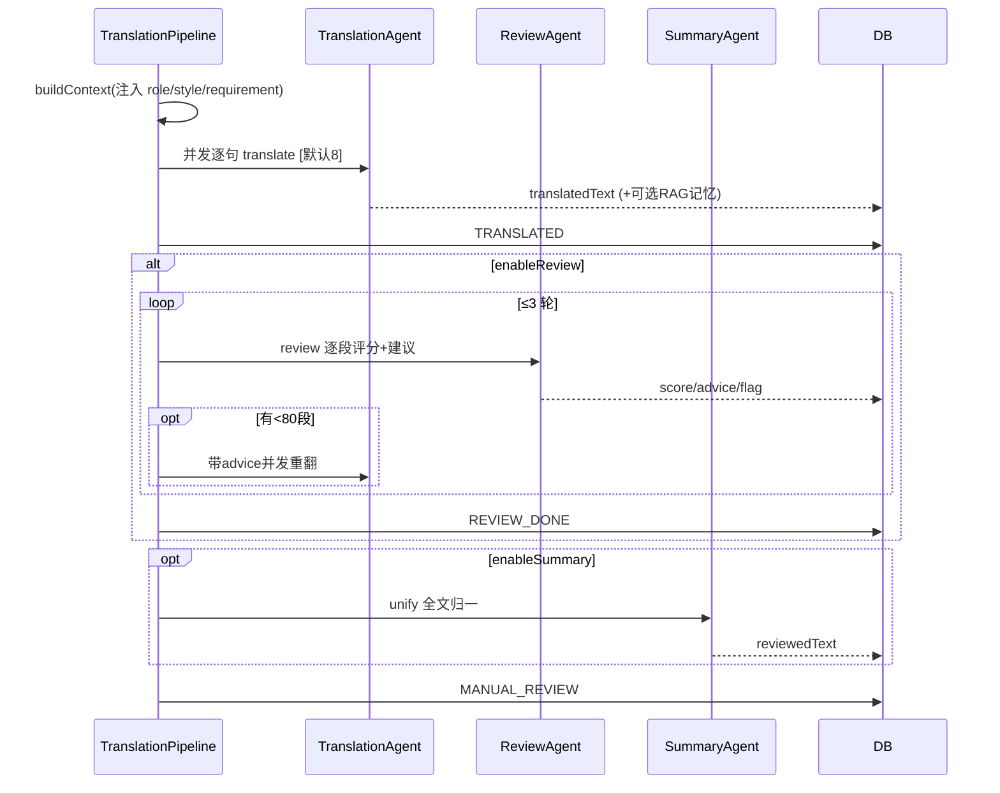

# AI Agent 层实现说明（agent + pipeline）

> 面向初次接手者。本层是本次按 V1 重做的核心。
> 位置：`com.xx.aitranslation.agent`（Agent）+ `service.pipeline.TranslationPipeline`（编排器）+ `service.ai.ChatModelRouter`（模型路由）。

---

## 1. 一句话理解

> 三个 Agent 各司其职：**翻译**（TranslationAgent）、**审校**（ReviewAgent）、**风格统一**（SummaryAgent）。
> 一个编排器 `TranslationPipeline` 按状态机把它们串起来：解析 → 并发翻译 → 审校循环 → 风格统一 → 人工审校。
> 所有 Agent 通过 `ChatModelRouter` 按「模型 code」运行时切换大模型（DashScope qwen-* / DeepSeek）。

---

## 2. 文件清单与职责

| 文件 | 角色 | 职责 |
|------|------|------|
| `agent/AgentContext` | DTO | 翻译调用上下文（Builder）。单句翻译与文档流水线共用。 |
| `agent/TranslationAgent` | V1 模块三/六 | 唯一翻译入口 `translate(AgentContext)`。带 `reviewAdvice` 即「反馈优化重翻」。 |
| `agent/ReviewAgent` | V1 模块五（AIPE） | 逐段评分 + 修改建议，分批结构化输出。 |
| `agent/SummaryAgent` | V1 模块七（新增） | 全文风格统一（术语/语气/人称/格式），分批 + orderNo 对齐。 |
| `service/ai/ChatModelRouter` | 基础设施 | 按模型 code 构建对应 `ChatClient`。 |
| `service/pipeline/TranslationPipeline` | 编排器（planner） | 状态机驱动、并发翻译、审校循环、收尾。 |
| `dto/ReviewResult` / `dto/SummaryResult` | 结构化出参 | 绑定 LLM 的 JSON 输出。 |
| `resources/prompts/*.st` | Prompt 模板 | `translation-prompt.st` / `review-prompt.st` / `summary-prompt.st`。 |

> 旧的 `service/ai/TranslationLlmService`、`ReviewLlmService`、冗余 `config/SpringAIConfig` 已删除，逻辑并入 agent 包。

---

## 3. 模型路由 `ChatModelRouter`

按模型 code 解析服务商并构建 `ChatClient`：

```java
public ChatClient client(String modelCode) {
    ModelCode model = ModelCode.fromCode(modelCode);     // 未识别回退 qwen-plus
    return switch (model.getProvider()) {
        case DEEPSEEK  -> ChatClient.builder(deepSeekChatModel)
                .defaultOptions(DeepSeekChatOptions.builder().model(code).temperature(0.2).build()).build();
        case DASHSCOPE -> ChatClient.builder(openAiChatModel)   // DashScope OpenAI 兼容
                .defaultOptions(OpenAiChatOptions.builder().model(code).temperature(0.3).build()).build();
    };
}
```

可选模型在 `enums/ModelCode`：`qwen-plus / qwen-max / qwen-turbo`（DashScope）、`deepseek-chat`（DeepSeek）。

---

## 4. 翻译 Agent `TranslationAgent`

### AgentContext 字段

```java
AgentContext.builder()
    .text(原文)
    .sourceLang("zh") .targetLang("en")  // 为空则模型自动识别方向
    .role(角色描述) .style(风格描述)       // 已解析为自然语言描述，可为空（用默认）
    .glossaryRules(术语规则文本)
    .ragContext(RAG 历史参考)
    .reviewAdvice(上一轮审校建议)          // 非空 = 反馈优化重翻模式
    .modelCode("qwen-plus")
    .build();
```

### 核心逻辑

```java
public String translate(AgentContext ctx) {
    ChatClient client = chatModelRouter.client(ctx.getModelCode());
    Map<String,Object> params = ...; // role/style/glossary/ragContext/advice 空值填「（无）」
    params.put("languageInstruction", buildLanguageInstruction(ctx.sourceLang, ctx.targetLang));
    params.put("inputText", ctx.getText());
    Prompt prompt = PromptTemplate.builder().resource(translationPrompt).build().create(params);
    String content = client.prompt(prompt).call().content();
    return ObjectUtils.isEmpty(content) ? "" : content.trim();
}
```

`languageInstruction`：显式指定源/目标 → `将X翻译为Y`；否则 → `自动识别源语言…`（单句翻译走这条）。
对应模板 `prompts/translation-prompt.st` 含变量：`{role}{style}{glossary}{ragContext}{advice}{languageInstruction}{inputText}`。

---

## 5. 审校 Agent `ReviewAgent`（AIPE）

- 原文/译文成对喂给审校模型，**逐段**输出 `{orderNo, score(0-100), advice}`。
- 长文按 `BATCH_SIZE=15` 分批送审后合并；**单批解析失败回退 80 分**（视为通过，防循环卡死）。
- 结构化输出绑定 `ReviewResult`：

```java
public record ReviewResult(List<SegmentReview> segments) {
    public record SegmentReview(int orderNo, int score, String advice) {}
}

ReviewResult r = client.prompt(prompt).call().entity(ReviewResult.class);
```

`orderNo` 必须与 `TranslationSentence.orderNo` 一致（审校建议靠它回写到对应句子）。

---

## 6. 汇总 Agent `SummaryAgent`（风格统一）

- 受任务 `enableSummary` 控制，**默认关闭**。
- 对全文译文做一致性归一（术语/语气/时态/人称/格式），按 15 段分批，以 `orderNo` 对齐。
- 失败回退原 `translatedText`，保证不丢译文。
- 结构化输出绑定 `SummaryResult`：

```java
public record SummaryResult(List<SegmentText> segments) {
    public record SegmentText(int orderNo, String text) {}
}

// 返回 orderNo -> 统一后译文
Map<Integer,String> unify(List<TranslationSentence> segs, requirement, sourceLang, targetLang, modelCode);
```

---

## 7. 编排器 `TranslationPipeline`

### 状态机

```
DRAFT → FILE_UPLOADED → PARSING → PARSED
      → TRANSLATING → TRANSLATED → [REVIEWING → REVIEW_DONE] → MANUAL_REVIEW
      → COMPLETED → EXPORTED        （任意异步异常 → FAILED）
```

### parseAsync（解析）

下载文件 → `DocumentParserFactory` 解析 → `DocumentParseService` 落库 → `PARSING→PARSED`；异常 → `fail()`。

### translateAsync（翻译主编排）

```java
@Async("taskExecutor")
public void translateAsync(Long taskId) {
    TranslationTask task = ...;
    TranslationContext ctx = buildContext(task);   // 快照：从 Project 注入 role/style/requirement

    List<TranslationSentence> sentences = listSentences(taskId);
    translateSentencesConcurrently(ctx, sentences);          // 并发初翻译
    transit(TRANSLATED);

    if (ctx.enableReview) reviewLoop(ctx);                    // 审校循环
    finalizeTranslation(ctx);                                 // 可选风格统一 + 写 reviewedText
    transit(MANUAL_REVIEW);
}
```

**并发翻译（V1 模块四）**：

```java
List<CompletableFuture<Void>> futures = sentences.stream()
    .map(sent -> CompletableFuture.runAsync(() -> translateOne(ctx, sent, null), translationExecutor))
    .toList();
CompletableFuture.allOf(...).join();   // 等全部完成
```

`translationExecutor`：固定线程池，并发度 = `app.translation.concurrency`（默认 8），队列 0 + `CallerRunsPolicy` 兜底。**按名注入**（`@Resource(name="translationExecutor")`），与编排级 `taskExecutor` 区分。

`translateOne`（每句）：构建术语（开启术语库时）+ RAG（开启历史优化时）→ `TranslationAgent.translate(...)` → 写 `translatedText` → 可选写 RAG 记忆。

### reviewLoop（审校循环，V1 模块五/六）

```java
for (round = 1..MAX_ROUND(3)) {
    transit(REVIEWING);
    ReviewResult r = reviewAgent.review(segs, requirement, sourceLang, targetLang, reviewModel);
    // 回写每句 reviewScore/advice/flag(score<80)；minScore 存任务级 reviewScore
    if (无 <80 段) break;
    // 带 advice 并发重翻被标记段（反馈优化）
    translateOne(ctx, seg, seg.getReviewAdvice());
}
transit(REVIEW_DONE);
```

及格线 `PASS_SCORE=80`，最大 `MAX_ROUND=3`（达上限即结束，不置 FAILED）。

### finalizeTranslation（收尾）

```java
Map<Integer,String> unified = ctx.enableSummary
    ? summaryAgent.unify(segs, requirement, sourceLang, targetLang, translateModel)
    : Map.of();
for (seg : segs)
    seg.setReviewedText(ctx.enableSummary ? unified.getOrDefault(orderNo, translatedText) : translatedText);
```

即 `reviewedText` = 风格统一结果（开启时）或直接复制 `translatedText`，作为人工审校初值。

---

## 8. 完整时序



---

## 9. 单句即时翻译（共用 Agent）

`TranslationService.translate(req)`：解析 role/style → 术语 → RAG 检索 → `TranslationAgent.translate(AgentContext)` → 写 MySQL 历史 + PGVector 记忆。
与文档流水线**共用同一 Agent 和 `translation-prompt.st`**，语言方向交模型自动识别。

---

## 10. RAG 记忆维度（`RagService`）

统一 metadata：`customerId + role + style + sourceLang + targetLang`；记忆内容统一存「原文：…\n译文：…」对。写入/检索维度一致，单句与文档路径可互相复用。

---

## 11. 接手须知 / 扩展点

- **新增模型**：在 `enums/ModelCode` 加 code + Provider；`ChatModelRouter` 已按 Provider 路由。若是新服务商，需在 `application.yml` 配 key 并在 Router 加分支。
- **改 Prompt**：直接编辑 `resources/prompts/*.st`（StringTemplate `{var}` 语法），变量需与 Agent 传参一致。
- **调并发**：`app.translation.concurrency`（注意大文档下游 LLM 限流/超时；线程池满时 `CallerRunsPolicy` 会用调用线程兜底执行）。
- **调审校策略**：`TranslationPipeline.PASS_SCORE` / `MAX_ROUND`；审校批大小在 `ReviewAgent.BATCH_SIZE`。
- **role/style 来源**：取自所属 `Project.role/style`，未配置则 Agent 用默认「通用译者/正式」。
- **防重入**：再次触发翻译由 `TranslationTaskController` 的 `transitFromAny` 状态校验拦截（翻译/审校进行中不在允许集合内）。
- **结构化输出失败**：Review/Summary 都有「批级回退」，不会因模型 JSON 异常中断整篇。
```
