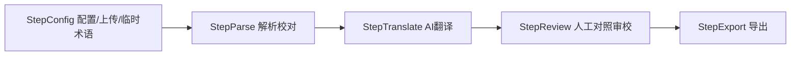
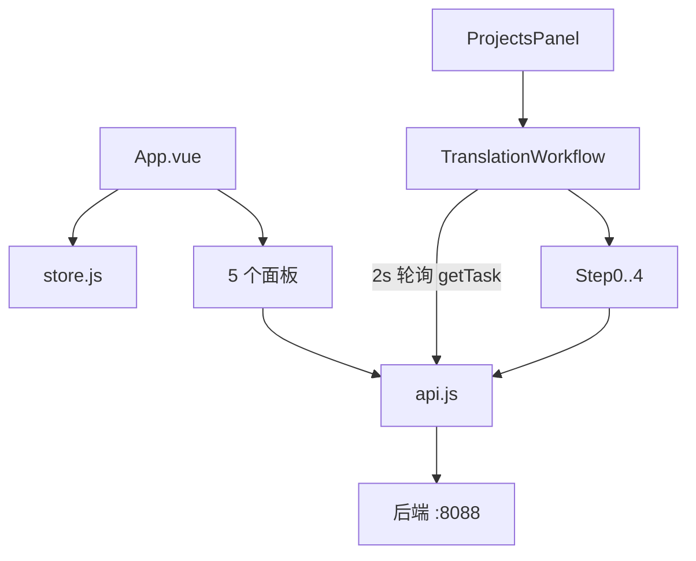

# 前端实现说明（Vue3 + Ant Design Vue）

> 面向初次接手者。位置：`ai-translation-frontend/`。
> 风格：温暖友好（warm / friendly）—— 奶油底 + 陶土主色 + 鼠尾草绿，圆润字体、柔和阴影、微动效。无需登录。

---

## 1. 一句话理解

> 单页应用，**无路由**，靠侧边菜单切换 5 个面板。
> 核心是「翻译工作流」：5 步（配置 → 解析校对 → AI 翻译 → 人工审校 → 导出），由**后端任务 `status` 驱动** + 进行中 2 秒轮询。
> 主题通过 AntD `a-config-provider` 注入暖色 token；视觉细节在 `style.css` 设计系统里。

---

## 2. 技术栈与启动

| 项 | 值 |
|----|----|
| 框架 | Vue 3（`<script setup>` 组合式）|
| UI 库 | Ant Design Vue 4（全局注册）|
| HTTP | Axios（统一拆 `Result` 包）|
| 构建 | Vite 5（dev 端口 5173，`/api` 代理到 `http://localhost:8088`）|
| 路由 / 状态库 | 无（自研 `reactive` store）|

```bash
cd ai-translation-frontend
npm install
npm run dev      # http://localhost:5173
npm run build    # 生产构建（已验证通过）
```

---

## 3. 文件清单与职责

| 文件 | 职责 |
|------|------|
| `index.html` | 引入 Google Fonts（Fraunces 展示 + Nunito 正文），标题「语译」。 |
| `src/main.js` | 挂载应用，`use(Antd)`，引入 `reset.css` + `style.css`。 |
| `src/App.vue` | 应用框架：`a-config-provider` 注入暖色主题 token；浅色暖调侧边栏 + 5 菜单切换。 |
| `src/style.css` | **设计系统**：CSS 变量色板/圆角/阴影/字体、暖色渐变网格背景、staggered 动效、工作流/审校/卡片样式。 |
| `src/store.js` | 全局状态：`customers / roles / styles / models / languages` + 中文标签方法。 |
| `src/api.js` | Axios 封装 + 全部接口方法。 |
| `src/components/TranslatePanel.vue` | 快速翻译（英雄式输入区）。 |
| `src/components/ProjectsPanel.vue` | 项目卡片网格 + CRUD + 进入工作流。 |
| `src/components/CustomersPanel.vue` | 客户管理（左表单 + 右列表）。 |
| `src/components/GlossaryPanel.vue` | 全量术语库（搜索 + 新增）。 |
| `src/components/HistoryPanel.vue` | 翻译历史卡片列表。 |
| `src/components/workflow/TranslationWorkflow.vue` | 工作流容器（步骤条 + 轮询 + 子步骤编排）。 |
| `src/components/workflow/Step*.vue` | 工作流 5 个步骤组件。 |

---

## 4. 设计系统（`style.css` + 主题 token）

### 配色（CSS 变量）

```css
--cream:#fbf7f0;  --surface:#fffdf9;            /* 奶油底 / 卡片面 */
--clay:#d4724e;   --clay-strong:#c05e3b;        /* 主色：陶土 */
--sage:#7c9473;   --amber:#e0a458;              /* 次强调 / 点缀 */
--ink:#3d3329;    --ink-soft:#6f6253;           /* 文字 */
--line:#ece1d1;                                  /* 暖色描边 */
```

### AntD 主题（`App.vue` 的 `warmTheme`）

```js
const warmTheme = {
  algorithm: antdTheme.defaultAlgorithm,
  token: {
    colorPrimary: '#d4724e', colorSuccess: '#7c9473', colorWarning: '#e0a458',
    colorTextBase: '#3d3329', colorBgContainer: '#fffdf9',
    borderRadius: 12, borderRadiusLG: 18,
    fontFamily: "'Nunito', ... 'PingFang SC', 'Microsoft YaHei', sans-serif"
  },
  components: { Menu: {...}, Steps: {...}, Card: {...} }
}
// <a-config-provider :theme="warmTheme"> 包裹整个布局
```

### 复用样式类

`.page-title/.page-subtitle`（页头）、`.soft-card`、`.project-grid/.project-card`、`.workflow-card`、`.run-stage`（运行态）、`.review-pane/.review-seg/.seg-highlight`（审校对照）、`.stagger`（载入交错动效）。

> 字体：拉丁标题 Fraunces、正文 Nunito，中文回退系统字体（不加载重量级中文 webfont，兼顾性能）。

---

## 5. 全局状态 `store.js`

```js
export const store = reactive({
  customers, roles, styles, models, languages,   // 元数据
  async loadMeta(),       // 并行拉 roles/styles/models/languages
  async loadCustomers(),
  roleLabel(code), styleLabel(code), langLabel(code)   // code → 中文展示
})
```

`App.vue onMounted` 调 `loadMeta()` + `loadCustomers()`。各面板列表/表单用组件内 `ref` 自管。

---

## 6. API 封装 `api.js`

- `baseURL:'/api'`，响应拦截统一拆包：`code===0` 返回 `data`，否则 `reject(Error(message))`。
- 关键方法（→ 后端）：
  - 快速翻译：`translate` → `POST /translate`
  - 元数据：`getRoles/getStyles/getModels/getLanguages`
  - 客户/项目/术语/历史：标准 REST
  - 工作流：`startProject` `getTask` `getTasksByProject` `saveTaskConfig` `uploadTaskFile` `parseTask` `getSegments` `updateSentences` `startTranslate` `saveSentenceFinal` `completeTask`
  - 导出：`StepExport` 直接拼 URL `GET /tasks/{id}/export?format=` 下载（不走 axios 拦截）。

---

## 7. 翻译工作流（核心）

### 容器 `TranslationWorkflow.vue`

- 5 步：`配置 / 解析与校对 / AI 翻译 / 人工审校 / 导出`。
- **状态 → 步骤映射** `statusToStep`：

| status | step |
|--------|------|
| DRAFT / FILE_UPLOADED | 0 |
| PARSING / PARSED | 1 |
| TRANSLATING / TRANSLATED / REVIEWING / REVIEW_DONE | 2 |
| MANUAL_REVIEW | 3 |
| COMPLETED / EXPORTED | 4 |
| FAILED | 步骤条 error + 显示 errorMsg |

- **轮询**：进行中（`PARSING/TRANSLATING/REVIEWING`）每 2s 拉 `getTask`；稳定态停止。
- 子步骤 `@next/@done` → 刷新任务；状态未前进时手动 `activeStep++`。



### 各步骤组件

| 组件 | 关键交互 / 接口 |
|------|------|
| `StepConfig` | 要求/描述/源目标语种/模型/开关（术语库、历史优化、AI 审校、**风格统一 enableSummary**）+ 文件上传 + 临时术语 CRUD。「保存配置并解析」→ `saveTaskConfig` → `parseTask` → `@next`。 |
| `StepParse` | `PARSING` 显示进度；`PARSED` 渲染分段（`getSegments`），可编辑原文 → `updateSentences` → `@next`。 |
| `StepTranslate` | 模型/审校设置，「开始 AI 翻译」→ `startTranslate` → `@next`；运行态显示进度（含审校轮次 `reviewRound`）。 |
| `StepReview` | 左原文 / 右译文（可编辑），滚动/悬停左侧高亮右侧对应段；逐段 `saveSentenceFinal`；「确认完成」→ 保存全部 → `completeTask` → `@done`。 |
| `StepExport` | 选 TXT/HTML，`GET /export` 下载。 |

### 审校页高亮联动（`StepReview.vue`）

```js
// 左栏滚动：取视口中部对应段的 orderNo，高亮右栏同 orderNo 段
function onLeftScroll() {
  const mid = leftEl.scrollTop + leftEl.clientHeight / 2
  const t = [...leftEl.querySelectorAll('[data-seg]')]
    .find(el => el.offsetTop <= mid && el.offsetTop + el.offsetHeight >= mid)
  if (t) highlight(t.dataset.seg)
}
// 译文默认值：finalText || reviewedText || translatedText；评分 <80 标红，建议 tooltip
```

---

## 8. 数据流总览



| 层级 | 管理 |
|------|------|
| 全局元数据 | `store.js` reactive |
| 面板列表/表单 | 组件内 `ref` |
| 工作流任务 + 步骤 | `TranslationWorkflow` 的 `task` / `activeStep` |

---

## 9. 接手须知 / 扩展点

- **加菜单/面板**：在 `App.vue` 的 `menuItems` 加项 + `<template>` 里 `v-if` 渲染新组件。
- **改主题色/圆角/字体**：改 `App.vue` 的 `warmTheme.token` + `style.css` 的 CSS 变量（两处保持一致）。
- **新增接口**：在 `api.js` 加方法；返回值已自动拆 `Result.data`。
- **新增工作流步骤配置项**：StepConfig 的 `form` 加字段 + `saveTaskConfig` payload 带上（后端 `TaskConfigRequest` 需有对应字段）。
- **lint 提示**：`vue/no-v-model-argument` 是项目里旧的 Vue2 ESLint 规则误报，AntD 的 `v-model:value` 是 Vue3 必需写法，**不要按它去掉参数**（会破坏双向绑定）；以 `npm run build` 为准。
- **轮询**：仅进行中状态轮询，组件卸载会 `clearInterval`，注意不要在新步骤里引入额外定时器泄漏。
```
