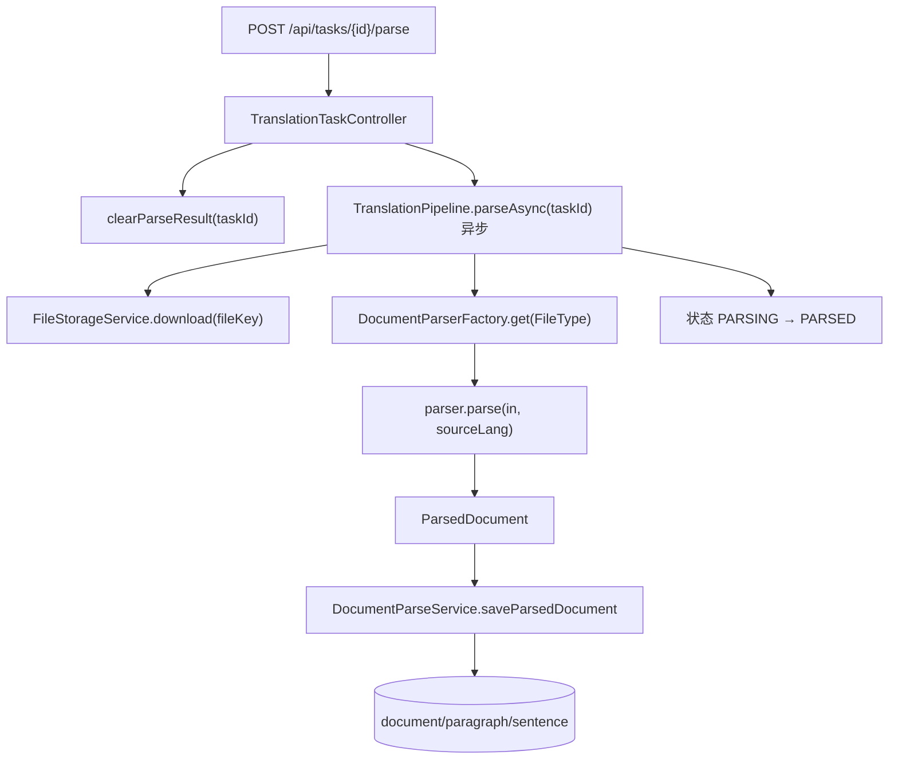

# 文档解析层实现说明（parse）

> 面向初次接手者。本层为**已验证逻辑，只改不重做**。位置：`com.xx.aitranslation.service.parse` + 落库服务 `service.DocumentParseService`。
> 作用：把上传的源文件（TXT / DOCX / HTML）拆成「文档 → 段落 → 句子」三层结构并落库，作为后续翻译/审校/导出的最小单元。

---

## 1. 一句话理解

> 输入：文件流 + 源语种 code（如 `zh`/`en`）
> 输出：`ParsedDocument`（内存结构）→ 落库为 `translation_document / translation_paragraph / translation_sentence`
> 翻译/审校/导出都以**句子（sentence）**为最小单元，用全局 `orderNo` 对齐。

---

## 2. 文件清单与职责

| 文件 | 职责 |
|------|------|
| `DocumentParser`（接口） | 定义 `ParsedDocument parse(InputStream, String sourceLang)` 与 `FileType supportType()`。 |
| `DocumentParserFactory` | Spring 注入所有 `DocumentParser` 实现，按 `supportType()` 注册到 `EnumMap`；`get(FileType)` 路由，未注册抛 `file.type.unsupported`。 |
| `DocxDocumentParser` | DOCX：Apache POI `XWPFDocument` 遍历段落，每段 SRX 分句。`supportType=DOCX`。 |
| `OkapiTxtDocumentParser` | TXT：按行（一行=一段），每段 SRX 分句。`supportType=TXT`。 |
| `OkapiDocumentParser`（抽象基类） | Okapi Filter 事件流通用解析逻辑，供 HTML 等格式复用。 |
| `OkapiHtmlDocumentParser` | HTML：`HtmlFilter` 抽取块级文本单元，`paraType="html"`。`supportType=HTML`。 |
| `ParseSrxLoader` | 加载 `/srx/langx-3.srx` 规则并做 SRX 分句；含空结果兜底。 |
| `ParseTextUtils` | 文本清洗（`removeControlChar`）与不可译过滤（`isNonTranslationText`）。 |
| `ParseLocaleHelper` | 源语种 code → Okapi `LocaleId`（影响 SRX 分句规则）。 |
| `ParsedDocument` / `ParsedParagraph` / `ParsedSentence` | 解析输出的内存三层结构（record）。 |
| `DocumentParseService` | 把 `ParsedDocument` 落库、读取、清理；生成全局 `orderNo`。 |

依赖库：`apache poi-ooxml`（DOCX）、`okapi`（HTML Filter + SRX 分句）。

---

## 3. 数据结构

### 内存结构（解析产物）

```java
public record ParsedDocument(List<ParsedParagraph> paragraphs) {}

public record ParsedParagraph(
        int orderNo,          // 段落顺序，从 0 递增
        String paraPosition,  // 段落定位：TXT/DOCX 为数字串；HTML 为 Okapi tu.getId()
        String paraType,      // "paragraph" 或 "html"
        String originalText,  // 段落完整原文（已清洗）
        List<ParsedSentence> sentences) {}

public record ParsedSentence(
        int sentIndex,        // 段内句子序号，从 0 递增
        String sentPosition,  // = String.valueOf(sentIndex)
        String sourceText) {} // 句子原文（已清洗）
```

### 落库结构（DB）

```
translation_document   一任务一条（uk_task_id）：fileName/fileKey/fileType/段数/句数
   └── translation_paragraph   orderNo / paraPosition / paraType / originalText
          └── translation_sentence
                 orderNo(文档级全局序号) / sentIndex(段内) / sentPosition
                 originalText / translatedText / reviewedText / finalText
                 reviewScore / reviewAdvice / reviewFlag
```

> **两套序号**：`sentIndex` 是「段内」序号；`orderNo` 是「文档级全局」序号，在落库时由 `globalOrder++` 生成。**审校对齐、导出顺序、前端扁平列表都依赖 `orderNo`**。

---

## 4. 解析流程（按格式）

### 公共预处理（所有格式共用）

```java
// 1. 清洗：NBSP→空格，\r\n\t→空格，trim
ParseTextUtils.removeControlChar(text);

// 2. 不可译过滤：空 / 纯邮箱 / 纯URL / 纯数字 / 纯标点符号空白 → 跳过
ParseTextUtils.isNonTranslationText(text);

// 3. 源语种 → LocaleId：en→en-US，其余→zh-CN（影响分句规则）
ParseLocaleHelper.toLocaleId(sourceLang);

// 4. SRX 分句
ParseSrxLoader.segment(locale, text);  // 或 Okapi createSourceSegmentation
```

### DOCX（`DocxDocumentParser`）

```java
try (XWPFDocument document = new XWPFDocument(in)) {
    int paraOrder = 0;
    for (XWPFParagraph paragraph : document.getParagraphs()) {
        String text = ParseTextUtils.removeControlChar(paragraph.getText());
        if (ParseTextUtils.isNonTranslationText(text)) continue;   // 过滤空段/纯符号
        List<ParsedSentence> sentences = ParseSrxLoader.segment(locale, text);
        paragraphs.add(new ParsedParagraph(paraOrder++, String.valueOf(paraOrder - 1),
                "paragraph", text, sentences));
    }
}
```

### TXT（`OkapiTxtDocumentParser`）

按行读取（UTF-8），**一行即一段**，再 SRX 分句。逻辑与 DOCX 基本一致，仅文本来源是 `reader.readLine()`。

### HTML（`OkapiHtmlDocumentParser` extends `OkapiDocumentParser`）

走 Okapi Filter 事件流，只处理 `TextUnit`：

```java
try (IFilter filter = createFilter()) {        // HtmlFilter
    RawDocument raw = new RawDocument(in, UTF_8, locale, LocaleId.EMPTY);
    filter.open(raw);
    while (filter.hasNext()) {
        Event event = filter.next();
        if (!event.isTextUnit()) continue;
        ITextUnit tu = event.getTextUnit();
        if (tu.isEmpty() || !tu.getSource().hasText()) continue;
        String tuText = ParseTextUtils.removeControlChar(tu.getSource().toString());
        if (ParseTextUtils.isNonTranslationText(tuText)) continue;
        tu.createSourceSegmentation(segmenter);                       // 段内分句
        List<ParsedSentence> sentences = ParseSrxLoader.fromTextUnit(tu, tuText);
        paragraphs.add(new ParsedParagraph(paraOrder++, tu.getId(),   // HTML 用 tu.getId() 定位
                resolveParaType(tu), tuText, sentences));             // "html"
    }
}
```

### SRX 分句兜底（`ParseSrxLoader.fromTextUnit`）

逐段清洗/过滤；**若分句结果为空但原文非空，则兜底为单句**，避免内容丢失：

```java
if (sentences.isEmpty() && !ObjectUtils.isEmpty(fallbackText)) {
    sentences.add(new ParsedSentence(0, "0", fallbackText));
}
```

> SRX 规则文件：`resources/srx/langx-3.srx`；启动时一次性加载，`trimLeadingWhitespaces/trimTrailingWhitespaces=true`。

---

## 5. 落库与读取（`DocumentParseService`）

### 落库 `saveParsedDocument(taskId, task, parsed)`

1. 校验：`parsed` 为空 / 无段落 / 句子总数为 0 → 抛 `parse.no.content`。
2. 插入 `translation_document`（文件元数据 + 段数/句数，元数据取自 `TranslationTask`）。
3. 顺序插入段落，再插入句子；**句子 `orderNo` 用 `globalOrder++` 跨段落连续递增**。

```java
int globalOrder = 0;
for (ParsedParagraph para : parsed.paragraphs()) {
    // insert paragraph ...
    for (ParsedSentence sent : para.sentences()) {
        TranslationSentence s = new TranslationSentence();
        s.setParagraphId(paragraph.getId());
        s.setOrderNo(globalOrder++);     // 全局对齐键
        s.setSentIndex(sent.sentIndex());
        s.setOriginalText(sent.sourceText());
        sentenceMapper.insert(s);
    }
}
```

### 对外读取 API

| 方法 | 用途 |
|------|------|
| `listSentences(taskId)` | 按 `orderNo` 升序返回句子列表（翻译/审校/导出用）。 |
| `listSentenceViews(taskId)` | 扁平句子视图（含 `blockType`），供 `GET /api/tasks/{id}/segments`（前端解析校对/审校页）。 |
| `listParagraphDetails(taskId)` | 段落树（含句子状态），供 `GET /api/tasks/{id}/paragraphs`。 |
| `updateSentence` / `saveFinal` / `resolveFinalText` | 句子写回、人工定稿、最终文本解析（`finalText > reviewedText > translatedText`）。 |
| `clearParseResult(taskId)` | 重解析前幂等删除旧 document/paragraph/sentence。 |

---

## 6. 调用链（与流水线的衔接点）



后续翻译阶段通过 `listSentences(taskId)` 取出句子逐句翻译。**解析层不感知翻译/模型**，是纯粹的文本结构化层。

---

## 7. 接手须知 / 扩展点

- **新增文件格式**：实现 `DocumentParser`（或继承 `OkapiDocumentParser` 提供 `createFilter`），声明 `supportType()`，加 `@Component`，并在 `FileType` 枚举与 `FileType.fromFileName` 后缀识别中补充即可，工厂自动注册。
- **分句不准**：调整 `srx/langx-3.srx` 规则或 `ParseLocaleHelper` 的语种映射（目前只精确区分 `en`，其余按 `zh-CN`）。
- **过滤误伤**：检查 `ParseTextUtils.isNonTranslationText`（邮箱/URL/数字/纯符号会被跳过）。
- **约束**：一个任务对应一个文档（DB `uk_task_id`）；重解析必须先 `clearParseResult`。
- **不要重写本层**：翻译/审校的对齐完全依赖此处生成的 `orderNo`，改动需保证序号语义不变。
```
